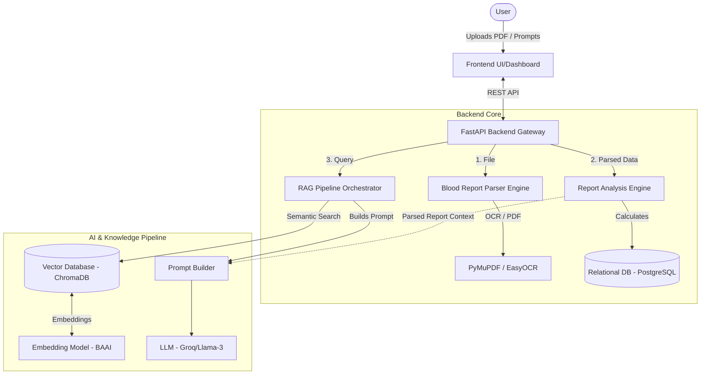
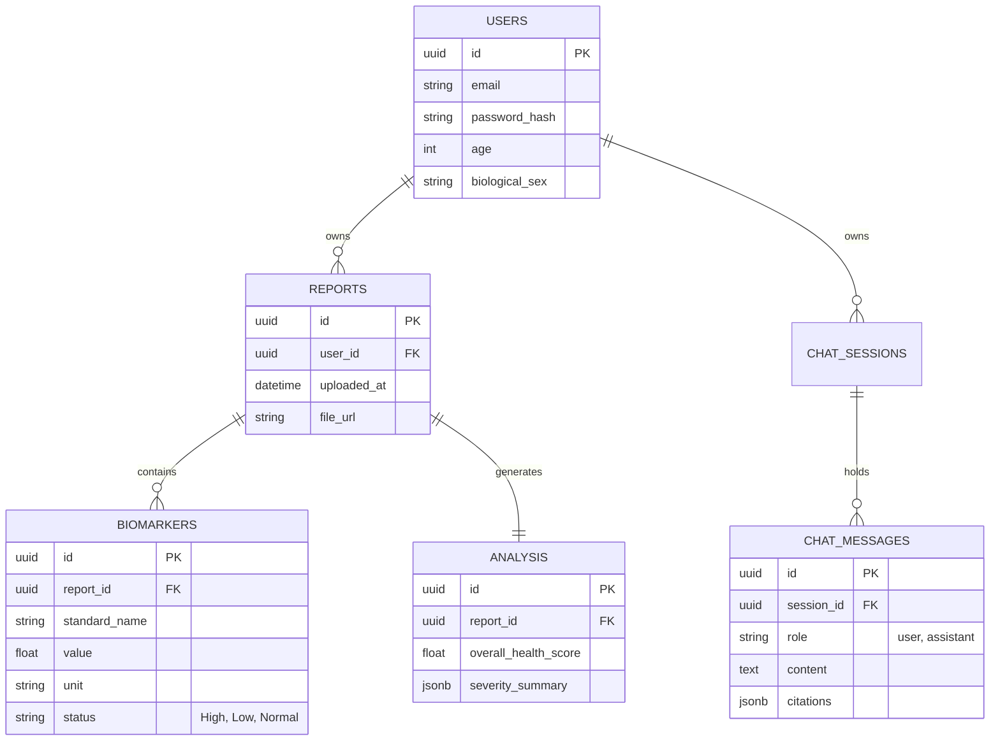
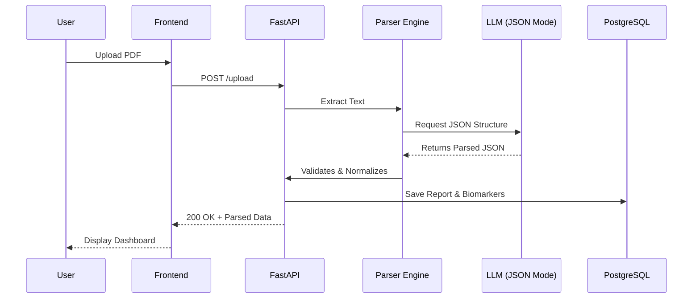

Here is the complete **Software Design Document (SDD)** for the **Blood Report Analyzer** platform. This document outlines a production-grade, highly scalable architecture modeled after industry-leading AI health platforms, designed to process raw health data into actionable, medically grounded intelligence.

---

# 1. Executive Summary

### Project Vision

To empower individuals with immediate, personalized, and scientifically accurate insights into their health by transforming static, complex blood reports into interactive, intelligent conversations grounded in verified medical literature.

### Goals

- Automate the extraction of structured biomarker data from unstructured PDFs/Images.
- Eliminate hallucination through strict RAG (Retrieval-Augmented Generation) constrained to curated medical documents.
- Provide a robust API and modular backend that can scale to thousands of users.
- Deliver an intuitive frontend dashboard for visualizing historical health trends.

### Target Users

- **Everyday Individuals:** Seeking to understand what their lab results mean without medical jargon.
- **Health Enthusiasts:** Tracking long-term biomarker optimization (e.g., biohackers).

### Key Features

- Multi-modal ingestion (PDF/OCR).
- Intelligent structured JSON extraction.
- RAG-powered, hallucination-free medical chatbot.
- Historical trend analysis and health scoring.

### Why RAG is Used

Large Language Models (LLMs) are prone to hallucinating medical advice. By employing RAG, the LLM is restricted to answering *only* using a provided, trusted Knowledge Base. This ensures that definitions, reference ranges, and physiological explanations remain scientifically accurate.

### Expected Workflow

User Uploads PDF → System extracts/parses biomarkers → System flags abnormalities → User views interactive dashboard → User chats with the AI to understand specific flags → System retrieves medical context and answers accurately.

---

# 2. High-Level System Architecture

The system follows a microservices-inspired monolithic architecture using FastAPI, designed to decouple parsing, retrieval, and generation logic.



### Component Breakdown:

- **Frontend UI:** React/Next.js SPA handling visualizations and chat interfaces.
- **FastAPI Gateway:** High-performance async server handling routes, auth, and validation.
- **Parser Engine:** Extracts structured `(Biomarker, Value, Unit)` from raw text.
- **Analysis Engine:** Compares parsed values against age/sex-adjusted reference ranges to flag anomalies.
- **RAG Orchestrator:** Manages the retrieval of medical markdown files corresponding to the flagged anomalies.
- **Vector DB (ChromaDB):** Persists embeddings for rapid semantic similarity search, replacing the current in-memory store.
- **LLM/Groq:** Generates the final human-readable response based strictly on the retrieved context.

---

# 3. Complete End-to-End Data Flow

```mermaid
flowchart LR
    A[Upload PDF] --> B[PyMuPDF Extraction]
    B --> C{Text Found?}
    C -- Yes --> E[Raw Text]
    C -- No --> D[EasyOCR Fallback]
    D --> E
  
    E --> F[LLM/Regex Parser]
    F --> G[Standardize Names & Units]
    G --> H[JSON Generation]
    H --> I[Reference Range Validation]
  
    I --> J[PostgreSQL Storage]
    J --> K[Dashboard Visualization]
  
    K --> L[User Asks Question]
    L --> M[Embed Query]
    M --> N[ChromaDB Retrieval]
    N --> O[Construct RAG Prompt]
    O --> P[Groq LLM Generation]
    P --> Q[Response to User]
```



**Data Flow Steps:**

1. **Extraction:** PDF is converted to raw text. If empty (scanned image), OCR runs.
2. **Parsing:** The unstructured text is fed into a structuring algorithm (regex or LLM tool-calling) to isolate specific markers.
3. **Normalization:** Variations like "HGB", "Hb", and "Hemoglobin" are unified to a standard ID.
4. **Validation:** The values are checked against standard ranges. "12.5 g/dL" is flagged if the range is "13.5-17.5".
5. **Storage:** Saved in a relational DB for future trend graphs.
6. **Chat/RAG:** When the user asks "Why is my hemoglobin low?", the query is embedded, relevant Markdown documents about anemia/hemoglobin are fetched from ChromaDB, injected into a prompt, and sent to the LLM.

---

# 4. Folder Structure

```text
blood-report-analyzer/
├── backend/
│   ├── api/                 # FastAPI routers (endpoints)
│   │   ├── v1/
│   │   │   ├── chat.py      # Chat endpoints
│   │   │   └── reports.py   # Upload and report retrieval
│   ├── core/                # App-wide settings, logging, security
│   ├── db/                  # SQLAlchemy models, migrations (Alembic)
│   ├── engine/              # Core business logic
│   │   ├── analyzer.py      # Reference range and severity logic
│   │   ├── parser.py        # PDF to JSON extraction
│   │   └── normalizer.py    # Standardization dictionaries
│   ├── rag/                 # RAG pipeline
│   │   ├── ingestion.py     # Markdown to ChromaDB pipeline
│   │   ├── retriever.py     # Similarity search logic
│   │   └── prompt.py        # System prompts and templates
│   ├── llm/                 # LLM provider integrations
│   ├── main.py              # FastAPI entrypoint
│   └── requirements.txt
├── frontend/                # Next.js / React application
│   ├── components/
│   ├── pages/
│   └── styles/
├── knowledge_base/          # Curated Markdown files
├── tests/                   # Pytest suite
│   ├── unit/
│   └── integration/
├── docker/                  # Dockerfiles and entry scripts
└── docker-compose.yml       # Orchestrates Backend + DB + VectorStore + Frontend
```

---

# 5. Database Design

**Primary DB:** PostgreSQL.
*Why?* Highly structured relational data (users → reports → biomarkers) requires ACID compliance. It handles concurrent reads/writes well and supports JSONB for flexible parser outputs.



---

# 6. Biomarker Data Model

The JSON structure representing a parsed report.

```json
{
  "report_id": "rep_123456",
  "patient_meta": {
    "age": 35,
    "sex": "M"
  },
  "biomarkers": [
    {
      "standard_name": "Hemoglobin",
      "raw_name": "Hb",
      "category": "Complete Blood Count",
      "value": 11.2,
      "unit": "g/dL",
      "reference_range": {
        "min": 13.8,
        "max": 17.2
      },
      "status": "Low",
      "severity": "Moderate",
      "explanation": "Below standard range. May indicate mild anemia.",
      "confidence_score": 0.98
    }
  ]
}
```

**Field Explanations:**

- `standard_name`: Resolves naming discrepancies across different labs.
- `severity`: Algorithmic tag (Normal, Borderline, Moderate, Critical) based on how far outside the range the value sits.
- `confidence_score`: OCR/Parser certainty (useful to flag manual review if < 0.8).

---

# 7. Blood Report Parser Design

1. **Extraction:** Use `PyMuPDF` for digital text. If `< 50` characters are extracted, fallback to `EasyOCR`.
2. **Detection:** Feed the raw text string to the LLM using **Structured Tool Calling (JSON Mode)**. LLMs are vastly superior to Regex for handling the chaotic, non-standard layouts of lab reports.
3. **Normalization:** The parser cross-references extracted names with a local dictionary (e.g., `{"hgb": "Hemoglobin", "vit_d3": "Vitamin D"}`).
4. **Duplicate Values:** Take the most recent if a report contains historical comparisons, identified by the date column.
5. **Malformed Reports:** If the LLM extraction confidence is low, the API returns a `206 Partial Content` prompting the user to manually verify the fields in the UI.

---

# 8. Report Analysis Engine

- **High/Low Detection:** Straightforward numeric comparison against `reference_range.min` and `max`.
- **Severity Calculation:**
  - *Borderline:* < 5% outside range.
  - *Moderate:* 5-20% outside range.
  - *Critical:* > 20% outside range.
- **Health Score Calculation:** Base 100. Deduct 2 points for Borderline, 5 for Moderate, 15 for Critical markers.
- **Priority Ranking:** Critical markers are surfaced to the top of the dashboard and injected first into the LLM context.

---

# 9. Knowledge Base Design

- **Organization:** Categorical directories (`/cbc`, `/lipids`, `/hormones`).
- **Markdown Structure:**
  - Strict hierarchical tags (e.g., `## Definition`, `## Causes of High Levels`, `## Symptoms`). This allows the `TextChunker` to slice documents semantically.
- **Metadata:** Frontmatter (YAML) at the top of each file containing `tags`, `related_markers`, and `last_updated` date for metadata filtering during retrieval.
- **Versioning:** Git-tracked. Re-ingested into ChromaDB via CI/CD when a commit touches the `/knowledge_base` folder.

---

# 10. RAG Pipeline

- **Embedding Model:** `BAAI/bge-small-en-v1.5` for fast, CPU-friendly dense vector generation.
- **Vector Database:** **ChromaDB**. Persistent, local, and lightweight. Replaces `InMemoryVectorStore` to prevent re-embedding on app startup.
- **Similarity Search:** Cosine similarity.
- **Metadata Filtering:** If the user asks about "Hemoglobin", the retriever first filters ChromaDB for chunks where `tags` include `hemoglobin`, drastically reducing noise.
- **Hallucination Prevention:** The prompt explicitly states: "If the context does not contain the answer, reply with 'I do not have enough information based on trusted medical literature.'"

---

# 11. Prompt Engineering Design

```text
[SYSTEM]
You are a highly capable AI medical assistant. 
You must ONLY use the [Retrieved Context] provided below to answer the user's question. 
Never invent medical facts. Never provide diagnostic conclusions.

[BLOOD REPORT ABNORMALITIES]
- Hemoglobin: 11.2 g/dL (Status: Low)
- Vitamin D: 15 ng/mL (Status: Low)

[RETRIEVED CONTEXT]
Source: cbc/hemoglobin.md
... {chunk_text_1} ...

Source: vitamins/vitamin_d.md
... {chunk_text_2} ...

[CONVERSATION HISTORY]
User: Are my results normal?
Assistant: You have two flagged markers: Hemoglobin and Vitamin D are both low.

[USER QUESTION]
What could be causing my low Vitamin D?

[OUTPUT INSTRUCTIONS]
Answer concisely based only on the context. Cite the markdown source file name at the end of your answer. Include a standard medical disclaimer.
```

*Why it minimizes hallucination:* By injecting the abnormal markers, retrieved context, and conversation history natively, and explicitly forbidding external knowledge, the LLM acts purely as a summarizer and formatter of trusted data.

---

# 12. LLM Integration

- **Abstraction:** The `LLM` Base Class allows hot-swapping.
- **Providers:**
  - *Groq (Llama-3-70b)*: Primary engine for ultra-fast, low-latency conversational responses.
  - *OpenAI (GPT-4o)*: Fallback engine for complex JSON structured extraction during the Parsing phase (where Llama-3 might struggle with strict JSON schemas).
- **Configuration:** Managed via `pydantic-settings` injecting `.env` variables safely into the application context.

---

# 13. API Design

### `POST /api/v1/reports/upload`

- **Input:** `multipart/form-data` (File).
- **Output:** JSON containing `report_id` and parsed `biomarkers`.
- **Validation:** File size limit (5MB), allowed extensions (.pdf, .jpg).

### `POST /api/v1/chat`

- **Input:** JSON `{ "report_id": "uuid", "message": "string", "session_id": "uuid" }`
- **Output:** JSON `{ "reply": "string", "citations": ["file.md"] }`
- **Error Handling:** Returns `404` if report/session not found. `429` for rate limits.

### `GET /api/v1/reports/{id}/history`

- **Output:** JSON array of historical biomarker values for line-chart generation.

---

# 14. Frontend Dashboard Design

- **Upload View:** Drag-and-drop zone with a loading skeleton while parsing occurs.
- **Dashboard:**
  - *Header:* Overall Health Score (e.g., 85/100).
  - *Alerts Section:* Red/Yellow warning cards for Critical/Moderate markers.
  - *Table View:* Full list of markers, values, ranges, and a visual slider showing where the user's value lands on the spectrum.
- **Chat Panel:** A persistent slide-out drawer on the right side. Context-aware (clicking a biomarker in the table automatically sends "Explain [Biomarker]" to the chat).

---

# 15. Sequence Diagrams

**Upload & Parse Sequence**



---

# 16. Deployment Architecture

- **Containerization:** `docker-compose` spins up 4 containers: `frontend`, `backend`, `postgres`, and `chromadb`.
- **Backend:** Gunicorn managing Uvicorn workers.
- **Reverse Proxy:** Nginx handling SSL termination and rate limiting.
- **CI/CD:** GitHub Actions that run tests, build Docker images, and trigger webhooks to a VPS (e.g., DigitalOcean or AWS EC2).

---

# 17. Testing Strategy

- **Parser Tests:** Supply known PDFs/text strings and assert the resulting JSON exactly matches expected outputs (crucial to prevent regressions in medical data).
- **Retriever Tests:** Assert that queries like "iron" return `iron.md` in the top 1 result.
- **Prompt Tests:** LLM-as-a-judge tests to ensure the prompt accurately blocks out-of-domain questions (e.g., "Write a poem").
- **API Tests:** `httpx` testing FastAPI route responses and status codes.

---

# 18. Logging and Monitoring

- **Logs:** Centralized JSON logging via Python's `logging` module.
- **Tracing:** Log the time taken for PDF extraction vs. LLM generation.
- **Error Tracking:** Sentry integration to catch OCR failures or LLM timeouts.
- **Monitoring:** Prometheus/Grafana endpoint exposed via FastAPI to track active users and API latency.

---

# 19. Security

- **PHI Protection:** Reports contain Protected Health Information (Names, DOB). The parser must strip this metadata before sending text to third-party LLMs (Groq/OpenAI) to maintain privacy compliance.
- **Prompt Injection:** Hardened system prompts and input sanitization to prevent users from bypassing the medical constraints.
- **Rate Limiting:** IP-based throttling on the `/chat` endpoint to prevent API cost overruns.
- **Auth:** JWT-based authentication for user sessions.

---

# 20. Scalability

- **Millions of Reports:** Handled easily by PostgreSQL with appropriate indexing on `user_id` and `biomarker_name`.
- **Stateless Backend:** The FastAPI backend holds no state (InMemoryVectorStore is removed). Thus, it can be horizontally scaled across multiple instances behind a load balancer.
- **New Embedding Models:** `EmbeddingModel` abstraction allows seamless transitions (e.g., from BAAI to OpenAI `text-embedding-3`). Requires a one-time migration script to re-embed the knowledge base.

---

# 21. Resume Features (To Impress Recruiters)

To elevate this from a "student project" to a "senior-level portfolio piece":

1. **Explainable AI (Citations):** Highlighting the exact sentence in the UI that the LLM used to generate its answer.
2. **Trend Analysis Engine:** Uploading 3 reports from different years and generating a line graph of Vitamin D progression over time.
3. **PHI Redaction:** Implementing an NER (Named Entity Recognition) step before the parser to scrub names and addresses, proving you understand data privacy (HIPAA concepts).
4. **Downloadable PDF Summary:** Using a library like ReportLab to generate a beautifully formatted PDF of the AI's analysis.

---

# 22. Development Roadmap

| Milestone                      | Goals                                                         | Files to Modify                                      | Difficulty | Effort |
| :----------------------------- | :------------------------------------------------------------ | :--------------------------------------------------- | :--------- | :----- |
| **M1: RAG Persistence**  | Implement ChromaDB & move Ingestion out of query loop.        | `rag_service.py`, `chroma_store.py`, `main.py` | Low        | 3 days |
| **M2: API Layer**        | Expose FastAPI routes, add Pydantic request/response models.  | `api/v1/`, `main.py`                             | Low        | 2 days |
| **M3: Parser Engine**    | Build the PDF-to-JSON LLM pipeline.                           | `parser.py`, `blood_report.py`                   | Hard       | 5 days |
| **M4: Database & State** | Integrate PostgreSQL via SQLAlchemy for tracking history.     | `db/`, `models/`                                 | Medium     | 5 days |
| **M5: UI Dashboard**     | Build React frontend with visualizations and chat side-panel. | `frontend/`                                        | Medium     | 7 days |
| **M6: Dockerization**    | Containerize the stack for one-click deployment.              | `Dockerfile`, `docker-compose.yml`               | Low        | 2 days |

---

# 23. Final Project Evaluation

**Target Audience:** Engineering Managers at Google, Microsoft, OpenAI.
**Estimated Score (If Designed & Built as Specified):** 9.5 / 10

**Strengths:**

- Solves a real-world, complex problem (unstructured medical data).
- Combines traditional software engineering (DBs, Auth, APIs) with modern AI engineering (RAG, Tool Calling, Vector DBs).
- Exhibits architectural maturity (separating ingestion from retrieval, interface-driven design, stateless scalability).

**Weaknesses:**

- OCR parsing can be highly brittle depending on the physical scan quality of a report. Extensive edge-case handling is required in production.

**What makes it unique:**
Typical student projects wrap a CSV in Streamlit and pass it to LangChain. This architecture manually constructs the RAG pipeline, implements structured JSON tool calling for data extraction, handles historical relational state in PostgreSQL, and enforces strict data privacy constraints. It demonstrates full-stack competence, AI integration skills, and product-minded design.
