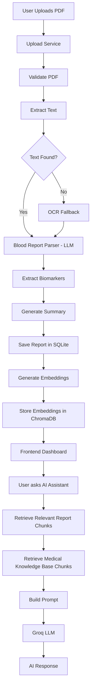
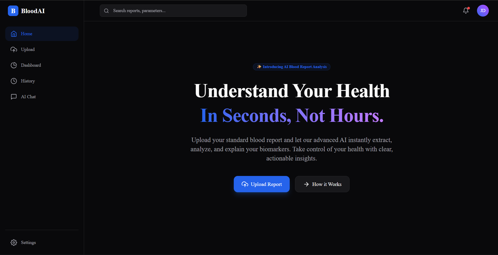
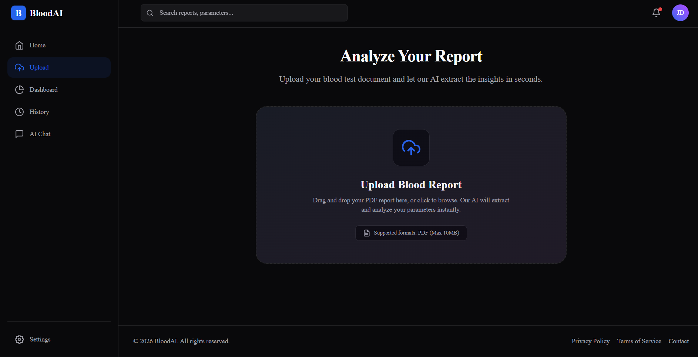
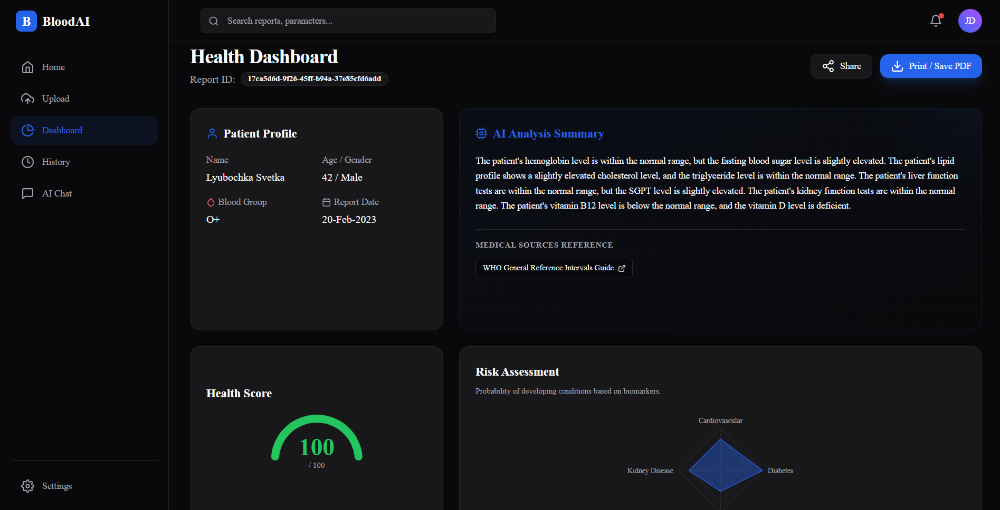
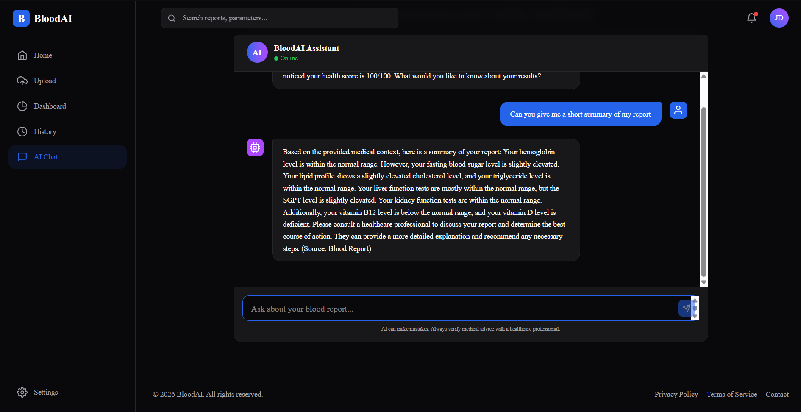

# Blood Report Analyzer

[](#tech-stack)
[](#tech-stack)
[](#tech-stack)
[](#tech-stack)
[](#tech-stack)
[](#tech-stack)

Blood Report Analyzer is an AI-powered web application that helps users understand blood test reports in plain language.
Users upload a report PDF, the system extracts biomarkers, flags abnormal values, generates a concise summary, and enables follow-up Q&A through a Retrieval-Augmented Generation (RAG) assistant.

---

## Project Overview

Medical reports can be difficult for non-technical users to interpret. This project focuses on:

- Converting raw blood report PDFs into structured medical data
- Highlighting clinically important values (e.g., HIGH/LOW markers)
- Generating simplified summaries
- Supporting natural-language Q&A grounded in:
  - the uploaded report, and
  - an indexed medical knowledge base

---

## Tech Stack

### Frontend

- React.js
- Vite
- JavaScript
- Tailwind CSS

### Backend

- FastAPI
- Python

### AI / ML

- Retrieval-Augmented Generation (RAG)
- Groq LLM
- Sentence Transformers
- `BAAI/bge-small-en-v1.5` embedding model

### Storage

- ChromaDB (vector store)
- SQLite (report metadata + parsed results)

### PDF Processing

- PyMuPDF
- EasyOCR (fallback for scanned/non-selectable PDFs)

---

## Backend Architecture (Modular Service-Based)

### 1) Upload Service

Handles report ingestion end-to-end:

- validates file type/size and PDF integrity
- computes file hash for deduplication
- saves files securely
- triggers text extraction + parsing
- persists structured report data

### 2) Report Service

Owns SQLite interactions:

- report insert/read/delete
- duplicate detection by `file_hash`
- biomarker history queries across reports

### 3) Chat Service

Bridges user chat requests with patient context:

- fetches report by `report_id`
- formats report biomarkers and summary
- forwards enriched context to RAG service

### 4) RAG Service

Core orchestration layer for question answering:

- retrieves top-k relevant chunks
- builds final prompt (report + KB context)
- calls Groq generator
- returns answer + citations

### 5) Blood Report Parser

LLM-based extraction layer:

- parses raw report text into structured JSON (patient details + biomarkers + summary)
- redacts sensitive PHI patterns before external LLM call

### 6) PDF Loader

Text extraction pipeline:

- first attempts direct PDF text extraction
- falls back to OCR per page if embedded text is missing

### 7) Chunking Pipeline

`TextChunker` converts documents into semantic chunks:

- splits by markdown headings
- applies sliding-window chunking for large sections
- preserves metadata (source, category, section)

### 8) Embedding Pipeline

`Embedder` + sentence-transformers:

- generates normalized embeddings for chunks and queries
- uses `BAAI/bge-small-en-v1.5`

### 9) ChromaDB Vector Store

Persistent similarity store:

- stores chunk embeddings + metadata
- supports metadata-filtered retrieval
- returns ranked relevant context for RAG

---

## Application Workflow



---

## Features

- 📄 PDF Upload
- 🧪 Blood Biomarker Extraction
- 📝 Automatic Summary Generation
- 📊 Report Dashboard
- 💬 AI Medical Assistant
- 🧠 Retrieval-Augmented Generation (RAG)
- 🔎 Similarity Search with ChromaDB
- 🔤 OCR Support for scanned reports
- 🔐 Secure and validated backend upload flow
- 🧩 Modular service-based architecture
- ⚡ Fast report processing pipeline

---

## Folder Structure

```text
health-report-analyzer/
├── backend/                     # FastAPI backend + RAG pipeline
│   ├── app/
│   │   ├── api/                 # Routes, dependencies, API layer
│   │   ├── core/                # Config, logging, startup lifecycle
│   │   ├── ingestion/           # Document loading, chunking, embeddings, indexing
│   │   ├── llm/                 # Groq client + answer generation
│   │   ├── models/              # Shared domain/data models
│   │   ├── parser/              # Blood report parser (LLM extraction)
│   │   ├── prompts/             # Prompt templates/builders
│   │   ├── retrieval/           # Retriever abstraction
│   │   ├── services/            # Upload, report, chat, RAG services
│   │   └── vector_store/        # ChromaDB integration
│   ├── main.py                  # FastAPI application entrypoint
│   ├── requirements.txt         # Python dependencies
│   ├── uploads/                 # Uploaded PDF storage
│   └── chroma_db/               # Persistent vector database
├── frontend/                    # React + Vite client app
│   ├── src/
│   │   ├── components/          # Reusable UI components
│   │   ├── pages/               # Route-level pages
│   │   ├── services/            # API clients (upload/chat/report)
│   │   ├── layouts/             # Shared layout containers
│   │   └── features/            # Feature-specific UI logic
│   └── package.json             # Frontend dependencies + scripts
└── knowledge_base/              # Markdown medical knowledge documents
```

---

## Installation

### 1) Clone repository

```bash
git clone https://github.com/Dnyaneshwar-dnyanu/health-report-analyzer.git
cd health-report-analyzer
```

### 2) Backend setup (Python)

```bash
cd backend
python -m venv venv
```

Activate environment:

- **Windows (PowerShell):**
  ```powershell
  .\venv\Scripts\Activate.ps1
  ```
- **macOS/Linux:**
  ```bash
  source venv/bin/activate
  ```

Install dependencies:

```bash
pip install -r requirements.txt
```

### 3) Frontend setup (Node)

```bash
cd ../frontend
npm install
```

### 4) Configure environment variables

Create a `.env` file in `backend/` using the sample below.

### 5) Run backend

```bash
cd ../backend
uvicorn main:app --reload --host 0.0.0.0 --port 8000
```

### 6) Run frontend

```bash
cd ../frontend
npm run dev
```

---

## Environment Variables (`backend/.env`)

```env
# Required
GROQ_API_KEY=your_groq_api_key_here

# Optional / model configuration
MODEL_NAME=llama-3.3-70b-versatile
EMBEDDING_MODEL_NAME=BAAI/bge-small-en-v1.5
HF_TOKEN=your_huggingface_token_here

# Paths / storage
VECTOR_DB_PATH=./chroma_db
CHROMA_DB_PATH=./chroma_db
DATABASE_URL=sqlite:///./reports.db
UPLOAD_DIRECTORY=./uploads
KNOWLEDGE_BASE_DIRECTORY=../knowledge_base

# Chunking
CHUNK_SIZE=400
CHUNK_OVERLAP=50

# CORS
ALLOWED_ORIGINS=http://localhost:5173,http://127.0.0.1:5173
```

---

## API Endpoints

| Feature                    | Method   | Endpoint                             | Description                                     |
| -------------------------- | -------- | ------------------------------------ | ----------------------------------------------- |
| Upload Report              | `POST` | `/api/upload`                      | Uploads and processes a blood report PDF        |
| Chat                       | `POST` | `/api/chat`                        | Answers user questions with report + KB context |
| Health Check               | `GET`  | `/health`                          | Service and dependency status check             |
| Report History (Biomarker) | `GET`  | `/api/reports/history/{biomarker}` | Returns biomarker trend values across reports   |
| List Reports               | `GET`  | `/api/reports`                     | Returns all uploaded reports                    |
| Get Report                 | `GET`  | `/api/reports/{report_id}`         | Returns one report by ID                        |

---

## Screenshots

### Landing Page



### Upload Screen



### Dashboard



### AI Chat



---

## Future Improvements

- User authentication and role-based access
- Persistent multi-user report history
- Compare multiple reports (trend over time)
- Doctor/clinician collaboration portal
- Downloadable report summary PDF
- Multi-language support
- Advanced biomarker trend dashboard
- Cloud object storage for reports
- Email notifications and reminders

---

## Disclaimer

This application is intended for **educational and informational purposes only**.
It is **not** a substitute for professional medical advice, diagnosis, or treatment.
Always consult a qualified healthcare professional for medical decisions.

---

## Contributing

Contributions are welcome!

1. Fork the repository
2. Create a feature branch:
   ```bash
   git checkout -b feature/your-feature-name
   ```
3. Commit your changes:
   ```bash
   git commit -m "feat: add your feature"
   ```
4. Push to your fork:
   ```bash
   git push origin feature/your-feature-name
   ```
5. Open a Pull Request with a clear description and test notes

Please keep changes focused, tested, and consistent with existing architecture.

---

## License

This project is licensed under the **MIT License**.
See the [LICENSE](./LICENSE) file for details.
