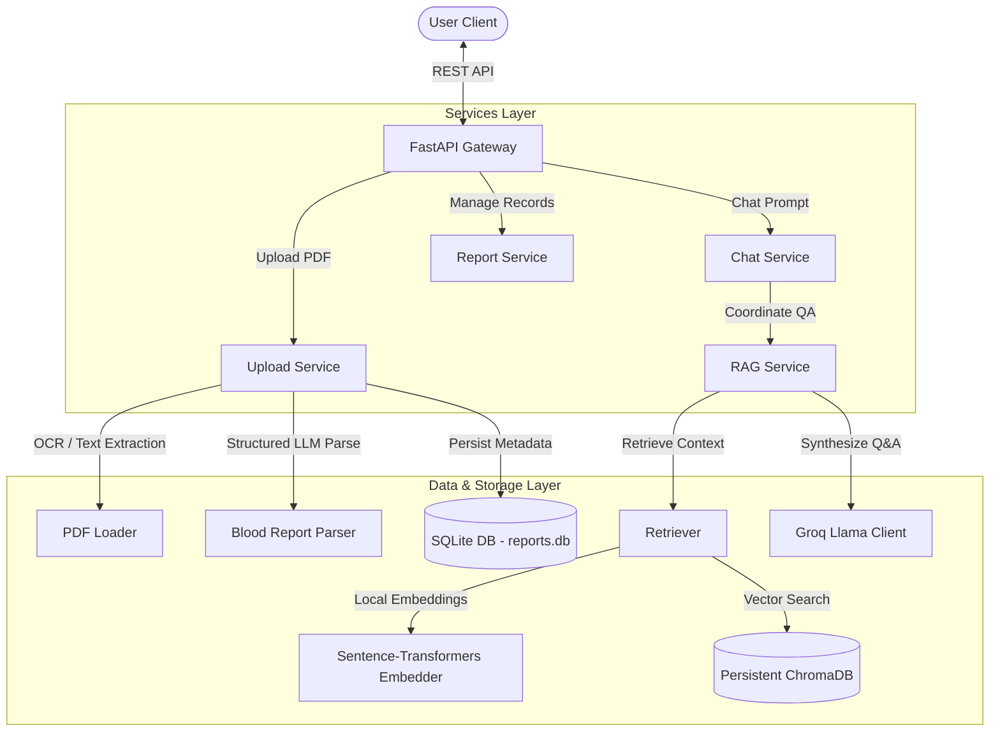

# Blood Report Analyzer Backend

A production-grade, asynchronous FastAPI backend that implements a Retrieval-Augmented Generation (RAG) system for medical questions, integrated with PDF upload parsing, structured biomarker extraction, SQLite history persistence, and persistent ChromaDB similarity search.

---

## 1. Project Architecture

The backend follows clean architecture principles, decoupling data loader, model inference, database persistence, and API gateway layers:



### Key Workflow Highlights:
1. **Lifespan Startup Event:** FastAPI boots up, initializes connection to persistent ChromaDB and local embedding model (`BAAI/bge-small-en-v1.5`). It checks document count in ChromaDB. If empty (`count == 0`), it automatically triggers the Knowledge Base indexing pipeline. Otherwise, it skips indexing and is ready immediately.
2. **Biomarker Parsing:** PDFs are uploaded, text is extracted (falling back to EasyOCR if pages are scanned), and sent to Groq with a strict schema prompt to extract a structured JSON containing patient name, date, biomarkers (value, range, unit, status), and a clinical summary.
3. **Persisted History:** Parsed reports are saved in SQLite (`reports.db`). When asking questions, the client can supply a `report_id` to automatically inject the patient's biomarker statistics as active context in the RAG prompt.

---

## 2. Folder Structure

```text
backend/
├── app/
│   ├── api/
│   │   ├── routes/
│   │   │   ├── chat.py
│   │   │   ├── health.py
│   │   │   ├── reports.py
│   │   │   └── upload.py
│   │   └── dependencies.py
│   ├── core/
│   │   ├── config.py
│   │   ├── logger.py
│   │   └── startup.py
│   ├── ingestion/
│   │   ├── chunking/
│   │   │   └── text_chunker.py
│   │   ├── loaders/
│   │   │   ├── markdown_loader.py
│   │   │   └── pdf_loader.py
│   │   ├── document_loader.py
│   │   ├── embedder.py
│   │   ├── embedding_model.py
│   │   └── indexer.py
│   ├── llm/
│   │   ├── generator.py
│   │   ├── groq_client.py
│   │   └── llm.py
│   ├── models/
│   │   ├── blood_report.py
│   │   ├── chunk.py
│   │   ├── document.py
│   │   ├── embedded_chunk.py
│   │   └── search_result.py
│   ├── parser/
│   │   └── blood_report_parser.py
│   ├── prompts/
│   │   ├── prompt.py
│   │   ├── prompt_builder.py
│   │   └── system_prompt.py
│   ├── retrieval/
│   │   └── retriever.py
│   ├── services/
│   │   ├── chat_service.py
│   │   ├── rag_service.py
│   │   ├── report_service.py
│   │   └── upload_service.py
│   └── vector_store/
│       ├── chroma_store.py
│       ├── in_memory_store.py
│       └── similarity.py
├── scripts/
│   └── test_production.py
├── chroma_db/
├── uploads/
├── .env
├── main.py
├── reports.db
└── requirements.txt
```

---

## 3. Environment Variables

Create a `.env` file in the `backend/` directory:

| Variable | Description | Default |
| :--- | :--- | :--- |
| `GROQ_API_KEY` | API Key for accessing Groq inference models | *(Required)* |
| `MODEL_NAME` | Groq LLM model name | `llama-3.3-70b-versatile` |
| `VECTOR_DB_PATH` | Storage directory for persistent ChromaDB | `chroma_db` |
| `UPLOAD_DIRECTORY` | Storage directory for uploaded PDF reports | `uploads` |
| `KNOWLEDGE_BASE_DIRECTORY` | Directory containing medical Markdown documents | `../knowledge_base` |

---

## 4. Setup Guide

### 1. Set Up Environment
```powershell
python -m venv venv
.\venv\Scripts\Activate.ps1
```

### 2. Install Dependencies
```powershell
pip install -r requirements.txt
```

### 3. Setup Configuration
Copy or edit `.env` and insert your `GROQ_API_KEY`.

### 4. Run Smoke Tests
Ensure everything works correctly (including offline SQLite operations and persistent ChromaDB storage):
```powershell
python scripts/test_production.py
```

### 5. Start Server
Run the FastAPI development server:
```powershell
python main.py
```
Or run via Uvicorn:
```powershell
uvicorn main:app --reload
```

---

## 5. API Documentation

Once the server is running, the interactive Swagger UI is available at:
`http://localhost:8000/docs`

### Summary of Endpoints:

#### Health Check
* **GET `/health`**
  Returns connectivity status of Groq, persistent ChromaDB counts, and general backend uptime.

#### Reports Ingestion
* **POST `/api/upload`**
  Accepts a `multipart/form-data` PDF file. Saves to disk, extracts text (OCR if scanned), parses biomarkers using Groq, persists to SQLite, and returns the structured JSON report.

#### Chat & Q&A
* **POST `/api/chat`**
  Accepts `{question: str, report_id: Optional[str]}`. Retrieves semantic medical contexts from ChromaDB and injects patient data (if `report_id` provided) to generate a medically grounded LLM answer.

#### Reports Management
* **GET `/api/reports`**
  Retrieves all parsed reports.
* **GET `/api/reports/{report_id}`**
  Retrieves details of a specific report.
* **DELETE `/api/reports/{report_id}`**
  Deletes report record from SQLite metadata storage.
